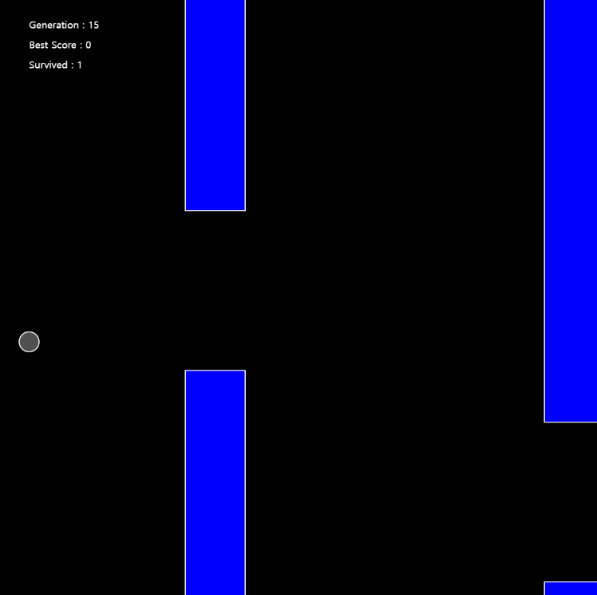

# Flappy-bird-AI
The purpose of this program is to apply genetic algorithm to "bird" objects flying under custom physics engine.
Genetic info from the longest surviving bird is carried on to the next generation.
As a result, there should be Nth generation in which one or more birds are "fit enough" to avoid obstacles and survive indefinitely (in theory).

